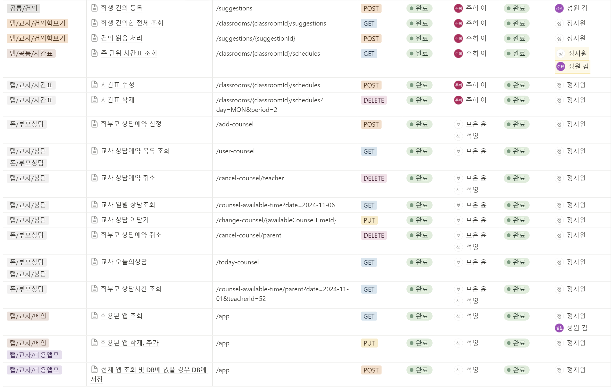

# 🔒PadLock
자동출석 및 교육용 앱 제어 서비스

## **목차**
1. 기획 배경 📚
2. 서비스 소개 🛠️
   - 자동 출석체크 기능 ✅
   - 등하굣길 자녀 위치 안내 서비스 🗺️
   - 교육용 앱 제어 서비스 📵
   - 판서 자동 필기 기능 ✍️
3. 기대 효과 🌟
4. 설계 🏗️
   - 와이어프레임
   - 시스템 아키텍처
   -ERD
   - API 명세서
5. 기술 스택 🛠️
6. 팀원 소개 👥

## **기획 배경 📚**
### 디지털 교과서와 태블릿의 도입
디지털 교과서와 태블릿은 가벼운 가방과 친환경적인 학습 환경을 제공하기 위해 도입되었다.  
현재 다수의 초·중학교에서 **교육용 태블릿**이 배포 및 활용 중이며, 2025년까지 전국적으로 도입 완료가 예상된다.

### 발생한 문제점
교육용 태블릿이 학습 외 목적으로 활용되는 사례가 지속적으로 보고되고 있다.  
주요 문제점은 다음과 같다:
- 웹툰 시청
- 유튜브 시청
- 게임 플레이

이러한 문제로 인해 학부모와 교사의 관리 부담이 가중되고 있다.

## **서비스 소개 🛠️**
### **1. 자동 출석체크 기능 ✅**
  
- **비콘(Bluetooth Signal)** 기술을 활용하여 교실에 출입하는 순간 출석 여부를 자동으로 기록.
- 주기적으로 자리 비움 및 결석 상태를 갱신하도록 설계.

### **2. 등하굣길 자녀 위치 안내 서비스 🗺️**
  
- GPS 트래킹을 통해 등하굣길 위치 정보를 실시간으로 학부모에게 제공.
- **학교 도착 시 알림 전송**, **하교 시 위치 정보 제공** 기능 포함.
- 개인정보 보호를 위해 등하굣길 전후로만 위치 데이터를 제공.

### **3. 교육용 앱 제어 서비스 📵**
  
  
- 교사가 지정한 교육용 앱만 사용 가능하도록 **kotlin으로** 시스템 제어.
- 학습 외 유혹을 최소화하며, 수업 시간 내 학습 집중도 향상을 목표로 설계.

### **4. 판서 자동 필기 기능 ✍️**
  
- **YOLOv8** 모델로 칠판 객체 인식
- 사진에 선생님(사람)이 있을 경우 **LAMA** 모델 inpainting로 사람 제거
- **OCR 기술**을 활용하여 칠판의 판서 내용을 자동으로 디지털화.
- 학생들의 판서 시간을 절약하고, 수업 내용에 대한 집중력을 높이는 기능 제공.

### **5. 급식 서비스 제공**
  
- 나이스 교육정보 개방 포털 급식 식단 정보 API 이용해 실제 급식 데이터 제공.

### **커스텀 시간표**
  
- 드래그 & 드롭 방식으로 시간표 수정

### **상담 예약 서비스**
  
  
- 선생님은 부담없고 학부모는 편안하게 예약 할 수 있도록 설계

### **알림 기능**
  
- SSE 방식으로 알림 발송

## **기대 효과 🌟**
- **학부모:** 자녀의 등하굣길 정보를 실시간으로 확인하여 불안을 해소.
- **교사:** 교육용 태블릿 관리 부담을 줄여 교육 활동에 집중 가능.
- **학생:** 판서 시간 감소 및 수업 흐름 유지로 학습 효율 증대.

## 🏗️ 설계
###  와이어 프레임
 

###  시스템 아키텍쳐
 

### ERD
 

###  API 명세서
 
 

## 🛠️ 기술 스택

**FE Development**

    

**BE Development**

     

**Database**

    

**AI**

  

**Infra**

   

**CI/CD**

  

**SUPPORT TOOL**

          

## 👥 팀원 소개
<table>
<tr>
    <td align="center"><a href="https://github.com/aswe0409"><b>👑정석영</b></a></td>
    <td align="center"><a href="https://github.com/kimsw0516"><b>김성원</b></a></td>
    <td align="center"><a href="https://github.com/boeunyoon"><b>윤보은</b></a></td>
    <td align="center"><a href="https://github.com/zhzzang"><b>이주희</b></a></td>
    <td align="center"><a href="https://github.com/stopvvon"><b>정지원</b></a></td>
    <td align="center"><a href="https://github.com/ssuinh"><b>홍수인</b></a></td>
  </tr>
 <tr>
     <td align="center"></td>
    <td align="center"></td>
    <td align="center"></td>
    <td align="center"></td>
    <td align="center"></td>
    <td align="center"></td>

  </tr>
  <tr>
    <td align="center"><b>AI & BE</b></a></td>
    <td align="center"><b>FE</b></a></td>
    <td align="center"><b>BE</b></a></td>
    <td align="center"><b>BE & INFRA</b></a></td>
    <td align="center"><b>FE</b></a></td>
    <td align="center"><b>FE</b></a></td>
  </tr>
</table>
